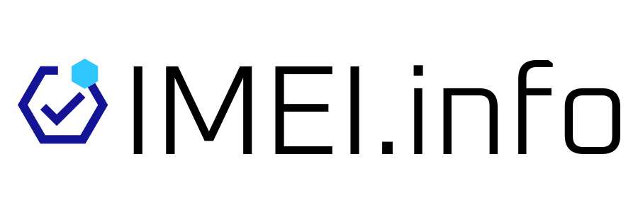

  <picture>
    <source media="(prefers-color-scheme: dark)" srcset="images/imei-info-banner-dark.svg">
    <source media="(prefers-color-scheme: light)" srcset="images/imei-info-banner-light.svg">
    
  </picture>

---

# IMEI CHECK API — Enterprise B2B Solutions by IMEI.info

Welcome to the official developer hub of **[IMEI.info](https://www.imei.info)**, the global leader in professional **IMEI check** services and mobile hardware intelligence. 

We deliver scalable, high-performance **IMEI CHECK API** integrations tailored specifically for B2B enterprise clients, including telecom operators, insurance providers, logistics firms, and e-commerce platforms. Powered by the world's largest TAC (Type Allocation Code) database, our infrastructure ensures seamless, automated device verification at scale.

### 💼 B2B Integration & Developer Resources
*   **[Official IMEI CHECK API Documentation](https://www.imei.info/api/imei/docs/)** – Explore our high-availability API endpoints, check integration guidelines, and learn how to implement automated lookup, blacklist status checks, and device specification retrieval.
*   **Open-Source SDKs** – Access ready-to-use code repositories and deployment examples in PHP, Python, JavaScript, and more to accelerate your business integration.

---

  Looking for custom B2B tiers, bulk volume pricing, or detailed company insights? Visit our official <b><a href="https://www.imei.info/about/">IMEI.info About Page</a></b>.

